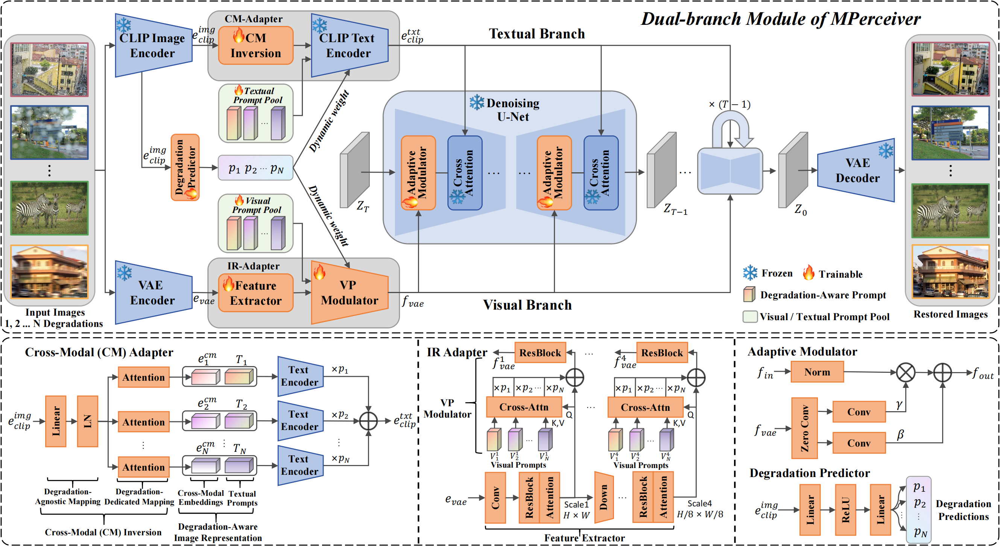

# MPerceiver (CVPR2024)
<a href='https://shallowdream204.github.io/mperceiver-project/'></a>  <a href='http://arxiv.org/pdf/2312.02918'></a>

## Abstract

Despite substantial progress, all-in-one image restoration (IR) grapples with persistent challenges in handling intricate real-world degradations. This paper introduces MPerceiver: a novel multimodal prompt learning approach that harnesses Stable Diffusion (SD) priors to enhance adaptiveness, generalizability and fidelity for all-in-one image restoration. Specifically, we develop a dual-branch module to master two types of SD prompts: textual for holistic representation and visual for multiscale detail representation. Both prompts are dynamically adjusted by degradation predictions from the CLIP image encoder, enabling adaptive responses to diverse unknown degradations. Moreover, a plug-in detail refinement module improves restoration fidelity via direct encoder-to-decoder information transformation. To assess our method, MPerceiver is trained on 9 tasks for all-in-one IR and outperforms state-of-the-art task-specific methods across many tasks. Post multitask pre-training, MPerceiver attains a generalized representation in low-level vision, exhibiting remarkable zero-shot and few-shot capabilities in unseen tasks. Extensive experiments on 16 IR tasks underscore the superiority of MPerceiver in terms of adaptiveness, generalizability and fidelity.




## Acknowledgement
Our code is built upon [StableSR](https://github.com/IceClear/StableSR), [Stable Diffusion](https://github.com/Stability-AI/stablediffusion), [NAFNet](https://github.com/megvii-research/NAFNet) and [BasicSR](https://github.com/XPixelGroup/BasicSR). We thank the authors for their awesome work.

## Contact
If you have any questions, please feel free to concat me out at `shallowdream555@gmail.com`.

## Citation

```BibTeX
@inproceedings{ai2024multimodal,
  title={Multimodal Prompt Perceiver: Empower Adaptiveness Generalizability and Fidelity for All-in-One Image Restoration},
  author={Ai, Yuang and Huang, Huaibo and Zhou, Xiaoqiang and Wang, Jiexiang and He, Ran},
  booktitle={Proceedings of the IEEE/CVF Conference on Computer Vision and Pattern Recognition},
  pages={25432--25444},
  year={2024}
}
```
